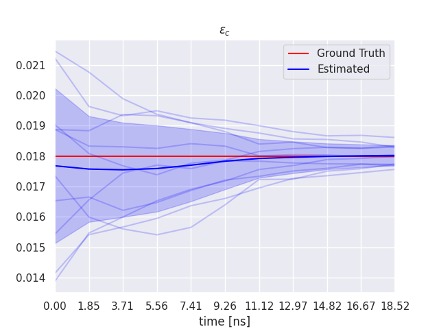
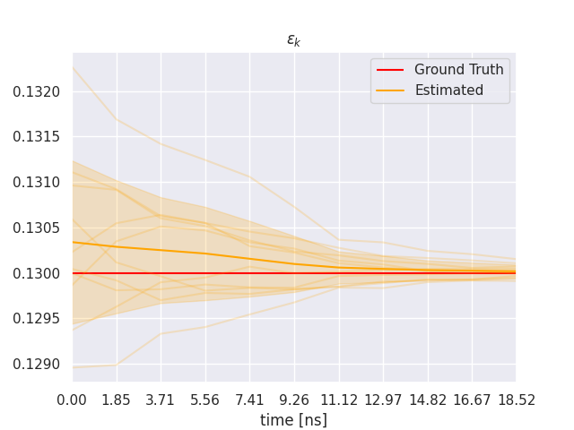

# douka plugin for Phase Field Model

$$
  \tau  \partial_t \phi = \nabla \left( W \nabla \phi \right) + \sum_{w=x,y} \partial_w \left(\left|\nabla \phi\right|^2 W \frac{\partial W}{\partial \left(\partial_w \phi\right)}\right) + \phi - \phi^3 - \lambda \left(\phi - \phi^2\right) u
$$


## Build & Install
### Build Tools
- `CMake`
- `Ninja`
- C++ Compiler
  - `C++17`
- douka
  - https://github.com/MaterialsModellingLab/douka.git
- phase_field
  - https://github.com/MaterialsModellingLab/phase_field.git
- libtensor
  - https://github.com/MaterialsModellingLab/libtensor.git

### X86 or ARM platform
Type the following command at the project root directory to build and install the plugin.

```bash
cmake --preset release
cmake --build build/release
cmake --install build/release
```

### F64AX platform
```bash
cmake --preset a64fx-release
cmake --build build/a64fx-release
cmake --install build/a64fx-release
```


## Run Data Assimilation
### Generate Parameter for Data Assimilation
```shell
./scripts/paramgen.sh
```

### Generate Observation Data
```shell
./scripts/obsgen.sh
```

### Generate Initial System Vector Distribution
```shell
./scripts/init.sh
```

### Run Data Assimilation
```shell
./scripts/run.sh 8
```

The 1st argument is the number of cores that can be used for data assimilation.
You can set the number of physical cores for the best performance.

### Show Results
Usage
```shell
usage: plot.py [-h] [--show] [--obs]

Plot the estimation results

options:
  -h, --help  show this help message and exit
  --show      Show the plot
  --obs       Show the observations in the plot
```



